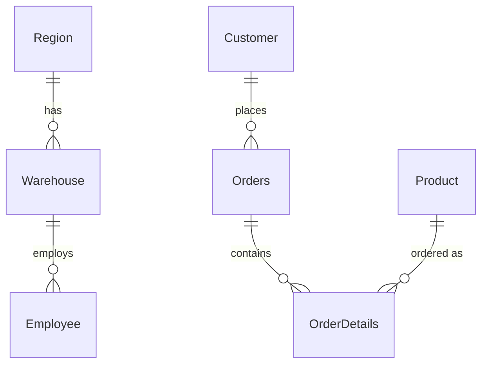

# inventory-fulfillment-analysis
SQL analysis of order fulfillment rates, inventory value, and warehouse distribution for an electronics retailer - includes a real data quality fix.
# Order Fulfillment & Inventory Performance Analysis

An analysis of order fulfillment performance, inventory value by product category, and warehouse distribution for an electronics retail company, using SQL to answer business questions and surface data quality issues that could otherwise mislead decision-making.

## Background

The company sells computer components (CPU, RAM, Storage, Motherboards, Video Cards) through a network of warehouses spread across several regions. This analysis set out to answer three practical questions: how well is the company fulfilling orders right now, which product categories carry the most value, and are there any data issues that need fixing before the numbers can be trusted.

## Data Source

Inventory Management dataset with 7 tables, 400 rows each:
- `Customer` — customer records and credit limits
- `Employee` — staff records and their assigned warehouse
- `Orders` — order headers
- `OrderDetails` — order line items, including fulfillment status
- `Product` — product catalog, pricing, and profit
- `Region` — operating regions
- `Warehouse` — warehouse records and their region

## Database Schema



## Tools Used

SQL (SQLite) for all querying and analysis.

## A Data Quality Note Before Diving In

Before trusting any of the numbers below, it's worth flagging something I ran into early on: the region **"North America"** was showing up as two separate values because of an inconsistent double space in one of the entries (`"North America"` vs `"North  America"`). Left as-is, this would have quietly split the company's largest region into two smaller, less impressive-looking ones. I cleaned it up with `REPLACE()` before grouping (see Question #3) — a good reminder that a single stray character can distort a whole region's reported footprint.

## Business Questions & Insights

### 1. How well is the company fulfilling orders right now?

```sql
SELECT OrderStatus, COUNT(*) AS jumlah,
  ROUND(COUNT(*) * 100.0 / (SELECT COUNT(*) FROM OrderDetails), 1) AS persentase
FROM OrderDetails
GROUP BY OrderStatus
ORDER BY jumlah DESC;
```

| OrderStatus | jumlah | persentase |
|---|---|---|
| Shipped | 183 | 45.8% |
| Canceled | 111 | 27.8% |
| Pending | 106 | 26.5% |

**Insight:** Barely under half of all orders — 45.8% — actually make it to Shipped. What stands out isn't just that fulfillment is low, it's that the leftover 54.2% splits almost evenly between Canceled and Pending, which points to two distinct problems rather than one. Pending suggests a backlog or stock issue that could still be resolved; Canceled suggests something already went wrong, whether that's stockouts, payment issues, or customers giving up on the wait. Either way, this is the number I'd bring to a meeting first.

### 2. Which product categories are carrying the most value?

```sql
SELECT product.CategoryName,
  SUM(orderdetails.OrderItemQuantity * orderdetails.PerUnitPrice) AS total_nilai_order
FROM product
JOIN orderdetails ON product.ProductID = orderdetails.ProductID
GROUP BY product.CategoryName
ORDER BY total_nilai_order DESC;
```

| CategoryName | total_nilai_order |
|---|---|
| Storage | 10,712,932 |
| Video Card | 5,746,482 |
| Mother Board | 5,555,189 |
| CPU | 5,366,747 |
| RAM | 3,138,740 |

**Insight:** Storage isn't just the top category — it's nearly double the next closest one. That kind of concentration means any stock or fulfillment problem in Storage has an outsized effect on total revenue, which makes it the natural place to start when investigating the fulfillment gap from Question #1.

### 3. How are warehouses and staff distributed across regions? (after cleaning the data)

```sql
SELECT REPLACE(region.RegionName, '  ', ' ') AS region_bersih,
  COUNT(DISTINCT warehouse.WarehouseID) AS jumlah_warehouse,
  COUNT(employee.EmployeeID) AS jumlah_karyawan
FROM region
LEFT JOIN warehouse ON region.RegionID = warehouse.RegionID
LEFT JOIN employee ON warehouse.WarehouseID = employee.WarehouseID
GROUP BY REPLACE(region.RegionName, '  ', ' ')
ORDER BY jumlah_warehouse DESC;
```

| region_bersih | jumlah_warehouse | jumlah_karyawan |
|---|---|---|
| North America | 223 | 223 |
| Asia | 88 | 88 |
| Australia | 45 | 45 |
| South America | 44 | 44 |

**Insight:** Once the duplicate "North America" entries were merged, its true size became obvious — 223 warehouses, more than double Asia, the next largest region. Before cleaning, this would have looked like a second-place region instead of a clear first, which is exactly the kind of quiet distortion that data quality issues cause: not wrong numbers exactly, just misleading ones.

### 4. Which products have the highest profit margins?

```sql
SELECT ProductName, CategoryName,
  ROUND(Profit / ProductListPrice * 100, 1) AS margin_profit
FROM Product
ORDER BY margin_profit DESC
LIMIT 10;
```

| ProductName | CategoryName | margin_profit |
|---|---|---|
| Hynix (H15201504-8) Genuine DDR2 2 GB | RAM | 40.1% |
| Simmtronics 2GB DDR2 667Mhz | RAM | 33.5% |
| G.Skill Ripjaws V Series | Storage | 29.9% |
| MSI X299 GAMING M7 ACK | Mother Board | 29.9% |
| Intel Core i7-6950X | CPU | 29.8% |

**Insight:** Here's a bit of a twist on Question #2 — Storage drives the most total revenue, but RAM is actually where the margins are best, north of 33%. Volume and profitability aren't the same story here, and that's worth pointing out: if the company wanted to grow profit rather than just revenue, pushing RAM harder might be a more efficient lever than doubling down on Storage.

### 5. Which products get stuck in Pending or Canceled most often?

```sql
SELECT product.ProductName, COUNT(orderdetails.OrderStatus) AS jumlah_order
FROM product
JOIN orderdetails ON product.ProductID = orderdetails.ProductID
WHERE orderdetails.OrderStatus IN ('Pending', 'Canceled')
GROUP BY product.ProductName
ORDER BY jumlah_order DESC
LIMIT 10;
```

| ProductName | jumlah_order |
|---|---|
| G.Skill Ripjaws V Series | 8 |
| G.Skill Trident Z | 5 |
| Corsair Vengeance LPX | 5 |
| Corsair Dominator Platinum | 5 |
| Kingston | 4 |

**Insight:** The "G.Skill Ripjaws V Series" tops this list with nearly double the next product's count — and it's worth noting this is the same product that showed up with one of the strongest margins in Question #4. That combination is the one I'd flag as most urgent: it's a genuinely profitable product that's also failing to ship at a higher rate than anything else, which likely means real revenue is being left on the table due to a stock or supply issue rather than a demand problem.

## Conclusion & Recommendations

1. **The 45.8% fulfillment rate deserves the first look.** Given that Storage dominates order value and that its own top product (G.Skill Ripjaws V Series) also has the highest Pending/Canceled count, stock availability in this category looks like the most likely culprit worth investigating first.
2. **North America is the company's largest region by a wide margin**, but only once the data was cleaned — resource planning should be based on the corrected figures, not the raw ones.
3. **RAM is quietly the most profitable category per unit**, even though it isn't the top seller. A pricing or promotion strategy that leans into this could improve margins without needing to grow overall volume.
4. **G.Skill Ripjaws V Series specifically should be checked for stock issues** — it combines high profitability with the worst fulfillment record in the dataset, which is the costliest kind of problem to leave unresolved.
5. **Text fields like region names should be validated as a standard step before analysis.** A one-character formatting inconsistency was enough to hide the company's largest region in this dataset — it's a cheap check that prevents an expensive mistake.
